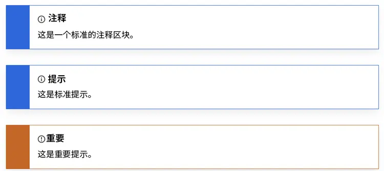
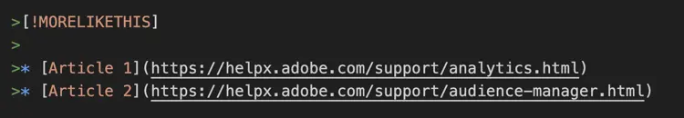
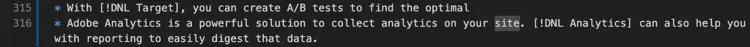

# 2024年08月25日


注：这仅仅是一个测试。这篇Blog的内容来自于Adobe公司网站关于Markdown的技术文档。

# 如何使用 Markdown 编写技术文档

最近更新： 2024年7月15日

Adobe 技术文档文章以名为 [Markdown](https://daringfireball.net/projects/markdown/) 的轻量级标记语言编写，这种方式易于阅读且易于学习。

当我们在 GitHub 中存储 Adobe Docs 内容时，该内容可以使用名为 [GitHub Flavored Markdown (GFM)](https://help.github.com/categories/writing-on-github/) 的 Markdown 版本，该版本提供了额外的功能，可满足常见的格式需求。此外，Adobe 还通过几种方式扩展了 Markdown，以支持某些与帮助相关的功能，如备注、提示和嵌入式视频。

## Markdown 基础知识

以下部分介绍了使用 Markdown 进行创作的基础知识。

### 标题

要创建标题，请在行首使用井号 (#)：

```none
# This is level 1 (article title)
## This is level 2
### This is level 3
#### This is level 4
##### This is level 5
```

Copy

Toggle Text Wrapping

### 基本文本

Markdown 中的段落不需要特殊语法。

要将文本格式设置为 **粗体**，请用两个星号将文本括起来。要将文本格式设置为 *斜体*，请用一个星号将文本括起来：

```markdown
   This text is **bold**.
   This text is *italic*.
   This text is both ***bold and italic***.
```

Copy

Toggle Text Wrapping

要忽略 Markdown 格式字符，请在字符前添加 \：

```markdown
This is not \*italicized\* type.
```

Copy

Toggle Text Wrapping

### 编号列表和项目符号列表

要创建编号列表，请在行首使用 `1.` 或 `1)`，但不要在同一列表中同时使用这两种格式。您无需指定编号。GitHub 会为您完成此操作。

```markdown
1. This is step 1.
1. This is the next step.
1. This is yet another step, the third.
```

Copy

Toggle Text Wrapping

将显示为：

1. This is step 1.
2. This is the next step.
3. This is yet another step, the third.

要创建项目符号列表，请在行首使用 * 或者 - 或 +，但不要在同一列表中混合使用这几种格式。（请勿在同一文档中混合使用项目符号格式，例如 * 和 +。）

```markdown
* First item in an unordered list.
* Another item.
* Here we go again.
```

Copy

Toggle Text Wrapping

将显示为：

- First item in an unordered list.
- Another item.
- 让我们再来一次。

您还可以在列表中嵌入列表并在列表项之间添加内容。

```markdown
1. Set up your table and code blocks.
1. Perform this step.

   

1. Make sure that your table looks like this:

   | Hello | World |
   |---|---|
   | How | are you? |

1. This is the fourth step.

   >[!NOTE]
   >
   >This is note text.

1. Do another step.
```

Copy

Toggle Text Wrapping

将显示为：

1. Set up your table and code blocks.

2. Perform this step.

   

3. Make sure that your table looks like this:

   | Hello | World    |
   | ----- | -------- |
   | How   | are you? |

4. This is the fourth step.

   > [!NOTE]
   >
   > This is note text.

5. Do another step.

### 表格

虽然表格不是核心 Markdown 规范的一部分，但 Adobe 仍在一定程度上支持它们。Markdown 不支持在单元格中使用多个行列表。最佳做法是避免在表格中使用多个行。您可以通过使用管道 (|) 字符绘制列和行来创建表格。连字符用于创建每个列的标题，而管道符用于分隔每个列。在表格前面添加一个空白行，以便该表格可正确呈现。

```markdown
| Header | Another header | Yet another header |
|--- |--- |--- |
| row 1 | column 2 | column 3 |
| row 2 | row 2 column 2 | row 2 column 3 |
```

Copy

Toggle Text Wrapping

将显示为：

| Header | Another header | Yet another header |
| ------ | -------------- | ------------------ |
| row 1  | column 2       | column 3           |
| row 2  | row 2 column 2 | row 2 column 3     |

Markdown 中可轻松处理简单的表格。但是，如果表格单元格中包含多个段落或列表，就会很难处理。对于此类内容，我们建议使用不同的格式，例如标题和文本。

有关创建表格的详细信息，请参阅：

- GitHub的[使用表组织信息](https://help.github.com/articles/organizing-information-with-tables/)
- [Markdown Tables Generator](https://www.tablesgenerator.com/markdown_tables) Web 应用程序
- [将 HTML 表转换为 Markdown](https://jmalarcon.github.io/markdowntables/)

### 链接

内联链接的 Markdown 语法由 `[link text]` 部分 + `(file-name.md)` 部分组成，前部分是将被添加超链接的文本，后部分是链接到的 URL 或文件名：

```
[link text](file-name.md)
[Adobe](https://www.adobe.com)
```

Copy

Toggle Text Wrapping

将显示为：

[Adobe](https://www.adobe.com/cn)

对于指向存储库中文章（交叉引用）的链接，请使用相对链接。您可以使用所有相对链接操作数，例如 ./（当前目录）、…/（上一级目录），以及 …/…/（上二级目录）。

```markdown
See [Overview example article](../../overview.md)
```

Copy

Toggle Text Wrapping

有关链接的更多信息，请参阅本指南的[链接](https://experienceleague.adobe.com/zh-hans/docs/contributor/contributor-guide/writing-essentials/linking)文章以了解链接语法。

### 图像

```markdown

```

Copy

Toggle Text Wrapping

将显示为：


### 代码块

Markdown 支持在句子中置入内联代码块，以及用于分隔句子的“受保护”块。有关详细信息，请参阅[Markdown对代码块的本机支持](https://daringfireball.net/projects/markdown/syntax#precode)

使用反撇号 (```) 在段落中创建内联代码样式。要创建特定的多行代码块，请在代码块之前和之后添加三个反撇号 (`````)（在 Markdown 中称为“受防护的代码块”，在 AEM 中只是一个“代码块”组件）。对于受保护的代码块，在第一组反撇号之后添加代码语言，以便 Markdown 正确地高亮显示代码语法。示例：````javascript`

示例：

```markdown
This is `inline code` within a paragraph of text.
```

Copy

Toggle Text Wrapping

将显示为：

This is `inline code` within a paragraph of text.

这是一个受保护的代码块：

```javascript
function test() {
 console.log("notice the blank line before this function?");
```

Copy

Toggle Text Wrapping

## 自定义 Markdown 扩展

Adobe 文章对大多数文章格式使用标准 Markdown，例如段落、链接、列表和标题。对于更丰富的格式，文章可以使用扩展的 Markdown 功能，例如：

- 备注块
- 嵌入式视频
- 翻译标记
- 组件属性，例如为标题分配不同的标题 ID 和指定图像大小

在每行开头使用 Markdown 块引用 ( > ) 可将扩展组件（例如备注）绑定在一起。

一些常见的 Markdown 元素（如标题和代码块）包含扩展属性。如果需要更改默认属性，请将参数添加到组件后面的大括号 /{ /} 中。上下文中介绍了扩展属性。

### 备注块

您可以从下面这些类型的备注块中选取，以吸引用户关注特定的内容：

- `[!NOTE]`
- `[!TIP]`
- `[!IMPORTANT]`
- `[!CAUTION]`
- `[!WARNING]`
- `[ !ADMINISTRATION]`
- `[!AVAILABILITY]`
- `[!PREREQUISITES]`
- `[!ERROR]`
- `[ !ADMINISTRATION]`
- `[!INFO]`
- `[!SUCCESS]`

通常，应谨慎使用备注块，因为它们可能具有破坏性。尽管它们也支持代码块、图像、列表和链接，但请尽量保持备注块简单、直观。

```markdown
>[!NOTE]
>
>This is a standard NOTE block.
```

Copy

Toggle Text Wrapping

```markdown
>[!TIP]
>
>This is a standard TIP.
```

Copy

Toggle Text Wrapping

```markdown
>[!IMPORTANT]
>
>This is an IMPORTANT note.
```

Copy

Toggle Text Wrapping

将显示为：



### 视频

嵌入式视频不会呈现在 Markdown 本地，但您可以使用此 Markdown 扩展。

```markdown
>[!VIDEO](https://video.tv.adobe.com/v/29770/?quality=12)
```

Copy

Toggle Text Wrapping

将显示为：

<iframe src="https://video.tv.adobe.com/v/29770/?quality=12" allowfullscreen="" scrolling="no" allow="encrypted-media" title="Content from video.tv.adobe.com" loading="lazy" style="border: 0px; top: 0px; left: 0px; width: 912px; height: 513px;"></iframe>

### 更多与此类似的内容

AEM 中的“更多与此类似的内容”组件显示在文章的末尾。此部分会显示相关链接。呈现文章时，可以将其格式化为与 2 级标题 (##) 相同的格式而不添加到 mini-TOC。



将显示为：

Related Articles

- [Article 1](https://helpx.adobe.com/cn/support/analytics.html)
- [Article 2](https://helpx.adobe.com/cn/support/audience-manager.html)

### UICONTROL 和 DNL

我们所有的 Markdown 帮助内容最初都是使用机器翻译进行本地化的。如果帮助内容从未本地化，那么我们会保留机器翻译。不过，如果帮助内容以前已经本地化，那么在人工翻译过程中，机器翻译的内容将充当占位符。

**``**

在机器翻译过程中，会在本地化数据库中检查标记为 `` 的项目，以获取适当的翻译。在 UI 未本地化的情况下，此标记将允许系统针对特定语言保留英语 UI 参考（例如 意大利语的 Analytics 参考）。

**源内容示例：**


**``**

通常，我们使用“不翻译”列表来告诉机器翻译引擎要保留哪些英文内容。最常见的项目是像“Adobe Analytics”、“Adobe Campaign”和“Adobe Target”这样的长解决方案名称。不过，在某些情况下，我们可能需要强制机器翻译引擎使用英语，因为相关术语可能会以特定或通用的方式使用。最明显的例子是解决方案的简短名称，例如“Analytics”、“Campaign”、“Target”等。机器很难理解这些是解决方案名称而不是通用术语。标记也可用于始终保留为英文的第三方名称/功能，或者用于较短的文本部分，例如必须保留为英文的短语或句子。

**源内容示例：**



## 难题和故障排除

### 替换文字

包含下划线的替换文字将无法正确呈现。例如，不要使用：

```markdown

```

Copy

Toggle Text Wrapping

我们的最佳实践是在文件名中使用连字符 (-)，而不是下划线 (_)。

```markdown

```

Copy

Toggle Text Wrapping

### 撇号和引号

如果将文本复制到 Markdown 编辑器，则文本可能包含“智能”（弯）撇号或引号。需要将这些符号编码或更改为基本撇号或单引号。否则，在发布文件时，最终将会得到这样的奇怪字符：It’s

以下是这些标点符号的“智能”版本的编码：

- 左（开）引号： `“`
- 右（闭）引号：`”`
- 右（闭）单引号或撇号：`’`
- 左（开）单引号（很少使用）：`‘`

### 尖括号

如果在文件中的文本（而非代码）中使用尖括号（例如，表示占位符），则需要手动编码尖括号。否则，Markdown 会认为它们是一个 HTML 标记。

例如，将`<script name>`编码为`<script name>`

### 标题中的与号

标题中不允许包含与号 (&)。请改用“和”，或使用 `&` 编码。

## 另请参阅

### Markdown 资源

- [Markdown 简介](https://daringfireball.net/projects/markdown/syntax)
- [GitHub 的 Markdown 基础知识](https://help.github.com/articles/markdown-basics/)


---

> 作者: 翁佳炜  
> URL: https://wengjw.netlify.app/posts/2024/08/25/  

